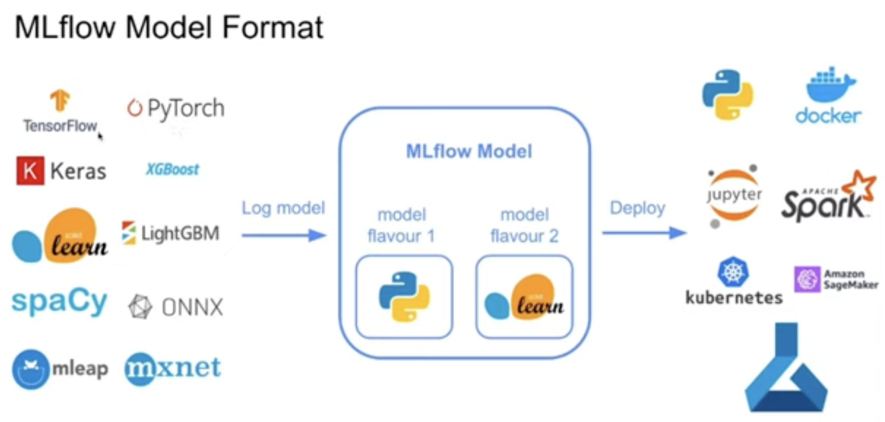
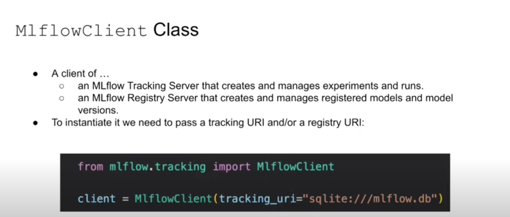
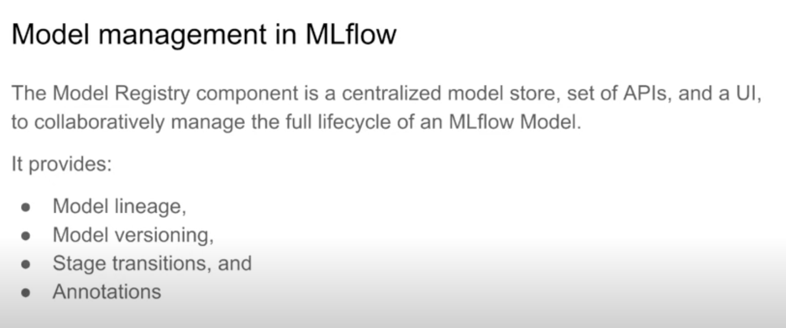

# MLOps with MLFlow
 Experimenting practical aspects of productionizing ML services — from training and experimenting to model deployment and monitoring with MLFlow. Credits to DataTalksClub.

## Installation
- Environment creation and requirements installation

```
conda create -n <NAME-OF-ENV> python=3.10
```

```
pip instal -r requirements.txt
```


## Launching MLFlow

```
mlflow ui --backend-store-uri sqlite:///mlflow.db
```

An empty MLFlow UI will be presented:


After running the notebook duration-prediction.ipynb, with hyperparameters search and definition of the model that have the top performance, the best model is saved as below:


#### Logging models with MLFlow:
- Log model as an artifact:

```
mlflow.log_artifact(local_path="models/mymodel", artifact_path="models/")
```

- Log model using the method log_model:
```
mlflow.<framework>.log_model(model, artifact_path="models/")
```

- ML Model format:



## Model Registry

To add a model it is required to clik on the model link in the Experiment page and clik on the button "Register Model" in the Model Overview page, Artifacts tab.

On top of that there are ways of using the MLFlowClient to interact with the Registry and experiments through an API. Step by step is shown in the file model-registry.ipynb.



### - Model Management




# MLFlow in Practice
The scenarios for running MLflow in MLFlow_examples show the following cases:
1 - A single data scientist participating in an ML competition
2 - A cross-functional team with one data scientist working on an ML model
3 - Multiple data scientists working on multiple ML models

For scenario 3, more information on AWS step by step on [Title](1_experiment_tracking/mlflow_on_aws.md)


