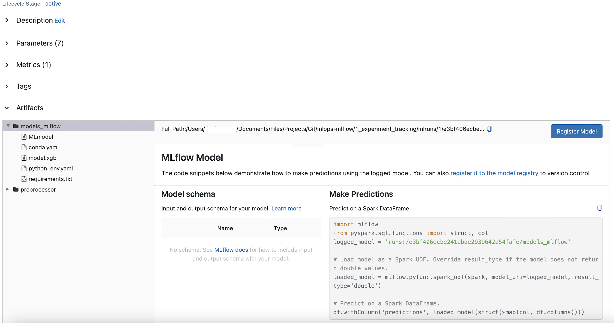

# MLOps with MLFlow
 Experimenting practical aspects of productionizing ML services — from training and experimenting to model deployment and monitoring with MLFlow

## Installation
- Environment creation and requirements installation

```
conda create -n <NAME-OF-ENV> python=3.10
```

```
pip instal -r requirements.txt
```


## Launching MLFlow

```
mlflow ui --backend-store-uri sqlite:///mlflow.db
```

An empty MLFlow UI will be presented:


After running the notebook duration-prediction.ipynb, with hyperparameters search and definition of the model that have the top performance, the best model is saved as below:





#### Logging models with MLFlow:
- Log model as an artifact:

```
mlflow.log_artifact(local_path="models/mymodel", artifact_path="models/")
```

- Log model using the method log_model:
```
mlflow.<framework>.log_model(model, artifact_path="models/")
```